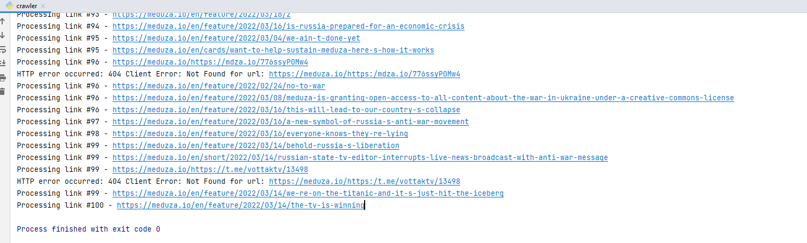

**1 задание**

В результате выполнения получаем:
1. Документы без html-кода, которые спарсили с сайта meduza.io. Файлы лежат в pages
2. Файл pages_list.txt, хранящий в себе номер документа и ссылку, откуда спарсили

