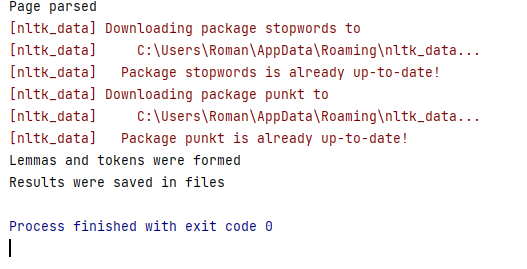

**Задание 2**

В результате выполнения задания получаем:
1. Файл tokens.txt, в котором хранятся токены из документов (полученных в 1-ом задании)
2. Файл lemmas.txt, в котором хранятся леммы

**Результат выполнения:** 

