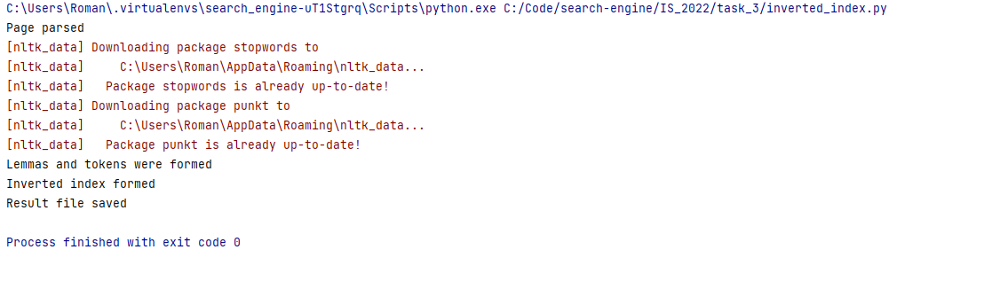
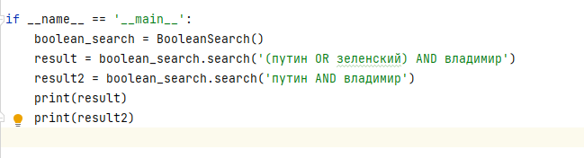
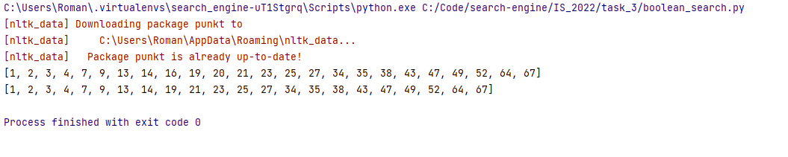

**Задание 3**

В результате работы **inverted_index.py** получаем:

1. Файл inverted_index.txt , хранящий в себе инвертированный индекс для булевого поиска

**Скрин результата выполнения:**

Работа boolean_search.py:

1. Создаем объект BooleanSearch()
2. Вызываем метод search(), в этот метод передаем в качестве параметра логическое выражение
3. На выходе получаем список документов, к которому относится данное выражение

