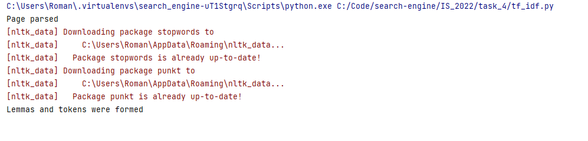

**4 задание**

В результате работы получаем следующие файлы:

1. lemmas->page_n.txt - хранятся леммы каждого документа + tf, idf и tf-idf (формат такой: лемма tf, idf tf-idf)
2. tokens->page_n.txt - хранятся токены каждого документа + tf, idf и tf-idf (формат такой: токен tf, idf tf-idf)

**Результат работы:** 

